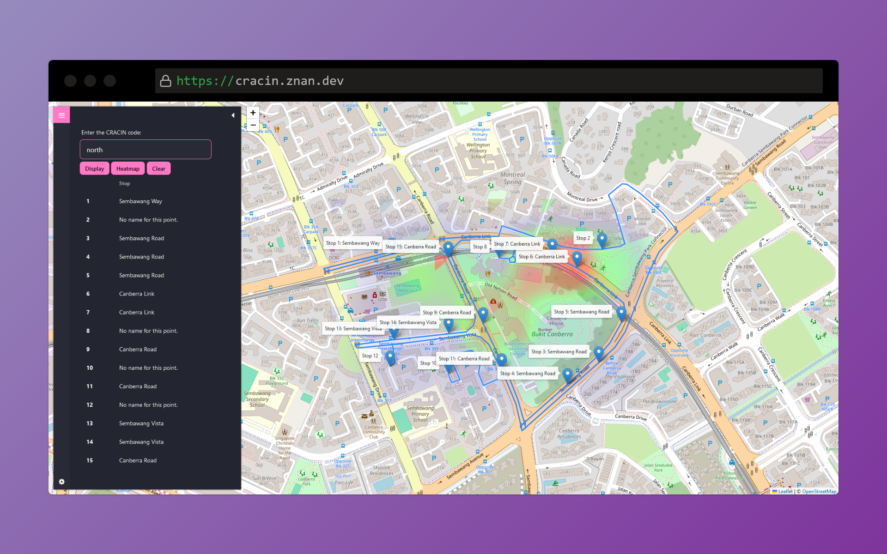
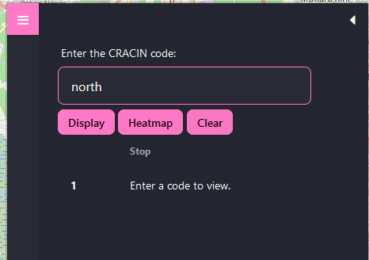

<a name="readme-top"></a>

<!-- PROJECT LOGO -->
<br />
<div align="center">
  <a href="https://github.com/recreationx/CrAcIn">
    
  </a>

<h3 align="center">CRAC(K)IN Crime</h3>

  <p align="center">
    Crime Activity Index (CrAcIn) Map
    <br />
    <a href="#"><strong>Explore the docs »</strong></a>
    <br />
    <br />
    <a href="https://cracin.znan.dev">View Demo</a>
  </p>
</div>


<!-- TABLE OF CONTENTS -->
<details>
  <summary>Table of Contents</summary>
  <ol>
    <li>
      <a href="#about-the-project">About The Project</a>
    </li>
    <li>
      <a href="#getting-started">Getting Started</a>
      <ul>
        <li><a href="#prerequisites">Prerequisites</a></li>
        <li><a href="#installation">Installation</a></li>
      </ul>
    </li>
    <li><a href="#usage">Usage</a></li>
    <li><a href="#roadmap">Roadmap</a></li>
    <li><a href="#contact">Contact</a></li>
  </ol>
</details>


<!-- ABOUT THE PROJECT -->
## About The Project




<p align="right">(<a href="#readme-top">back to top</a>)</p>

### Problem statement

Design a solution to seamlessly integrate crime hotspots analysis with patrol route optimization allowing law enforcement agencies to prioritize on higher crime risk areas and shorten emergency response times

### Solution
Our team has developed the CRACIN (Crime Activity Index), which incorporates data on the severity, frequency, location, and timing of recent crimes. Using our CRACIN data as the base, our solution optimizes routes for patrolling policemen to be able to respond to emergencies by being as close as possible to various crime hotspots. 

### Building the solution
Our team opted to develop a website accessible via both computers and mobile devices, providing flexibility for law enforcement personnel on the move. We utilized JavaScript on the front-end, leveraging the JavaScript Leaflet library to construct the Singapore Map and display optimized routes for the law enforcement personnel. Subsequently, Python was employed at the back-end to sift through and handle data from our crafted sample database, creating the Crime Activity Index (CRACIN). Since real-time crime data is not accessible, we populated the database with sample data representing four regions of Singapore. We then integrated the open-source ORSM API to compute optimal routes. Utilizing CRACIN, we also generated a heatmap depicting crime activity density across localized regions, thereby highlighting areas prone to criminal incidents.

### Built With

Frameworks/libraries used with this project:


[![Tailwind][tailwind]][tailwind-url]

<!-- GETTING STARTED -->
## Getting Started

To get a local copy up and running follow these simple example steps.

### Prerequisites

It is recommended to run this within a virtual environment.
* python
  ```sh
  virtualenv env
  source /bin/env/activate
  ```

### Installation

1. Clone the repo
   ```sh
   git clone https://github.com/recreationx/CrAcIn.git
   ```
3. Install Python packages
   ```sh
   pip install -r requirements.txt
   ```
4. Run project
   ```sh
   flask run --app main
   ```

For contributions, a `package-lock.json` file and `package.json` file is not provided in this repo.

1. Install `node.js`
2. Install `tailwindcss` and `daisyUI`. Refer to the websites for reference.
* tailwind.config.js
  ```javascipt
  /** @type {import('tailwindcss').Config} */
  module.exports = {
    content: ["./templates/*.html", "./static/**/*.js"],
    theme: {
      extend: {},
    },
    plugins: [require("@tailwindcss/typography"), require("daisyui")],
    daisyui: {
      themes: ["dracula"],
    },
  };
  ```
3. Follow the instructions on tailwind's site.

<p align="right">(<a href="#readme-top">back to top</a>)</p>


<!-- USAGE EXAMPLES -->
## Usage
The demo application contains the following CRACIN codes for your testing: `north`, `south`, `east`, `west` and `demo`.



The CRACIN code is a code that is provided to patrolling officers on duty. The CRACIN platform provides a graphical interface via a website for a patrolling officer to effectively visualize their route.

When the buttons `Display` and `Heatmap` are pressed, you will be able to see the following:


The application assumes that the patrolling officer is driving. On the left, the sequence of the stops needed to be taken on the patrolling route is shown. On the right, the patrolling route is shown in blue, with markers labelling the stops required to be taken, and a heatmap indicating the crime intensity at that particular area.

<p align="right">(<a href="#readme-top">back to top</a>)</p>


<!-- ROADMAP -->
## Roadmap

We hope to enhance the application further by adding support for different travel modes, such as walking and biking. This would largely increase the versatility of the application. We also hope to include an easy to use GUI that allows patrolling officers to easily drag-and-drop markers and plan the most effective route.

<p align="right">(<a href="#readme-top">back to top</a>)</p>

<!-- CONTACT -->
## Contact

- Zheng Nan - @recreationx
- Damien
- Glendon

Project Link: [https://github.com/recreationx/CrAcIn](https://github.com/recreationx/CrAcIn)

<p align="right">(<a href="#readme-top">back to top</a>)</p>


<!-- MARKDOWN LINKS & IMAGES -->
<!-- https://www.markdownguide.org/basic-syntax/#reference-style-links -->
[contributors-shield]: https://img.shields.io/github/contributors/recreationx/CrAcIn.svg?style=for-the-badge
[contributors-url]: https://github.com/recreationx/CrAcIn/graphs/contributors
[forks-shield]: https://img.shields.io/github/forks/recreationx/CrAcIn.svg?style=for-the-badge
[forks-url]: https://github.com/recreationx/CrAcIn/network/members
[stars-shield]: https://img.shields.io/github/stars/recreationx/CrAcIn.svg?style=for-the-badge
[stars-url]: https://github.com/recreationx/CrAcIn/stargazers
[issues-shield]: https://img.shields.io/github/issues/recreationx/CrAcIn.svg?style=for-the-badge
[issues-url]: https://github.com/recreationx/CrAcIn/issues
[license-shield]: https://img.shields.io/github/license/recreationx/CrAcIn.svg?style=for-the-badge
[license-url]: https://github.com/recreationx/CrAcIn/blob/master/LICENSE.txt
[linkedin-shield]: https://img.shields.io/badge/-LinkedIn-black.svg?style=for-the-badge&logo=linkedin&colorB=555
[linkedin-url]: https://linkedin.com/in/linkedin_username
[product-screenshot]: images/screenshot.png
[tailwind]: https://img.shields.io/badge/tailwindcss-%2338B2AC.svg?style=for-the-badge&logo=tailwind-css&logoColor=white
[tailwind-url]: https://tailwindcss.com/