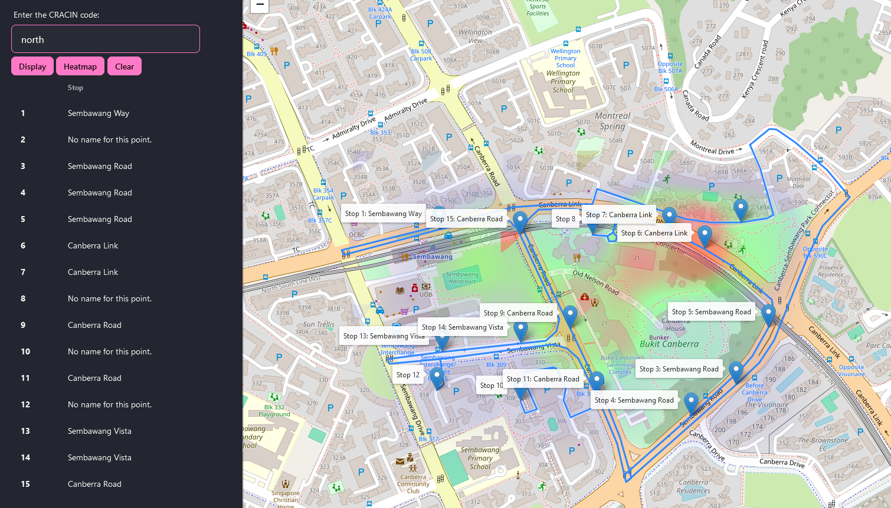
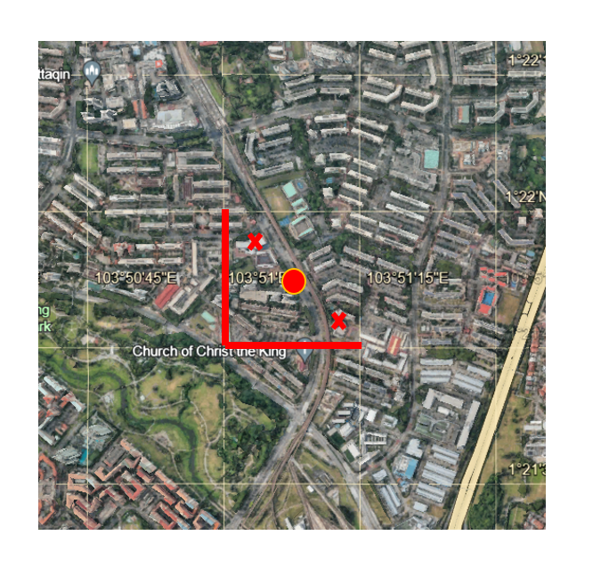

<a name="readme-top"></a>

<!-- PROJECT LOGO -->
<br />
<div align="center">
  <a href="https://github.com/recreationx/CrAcIn">
    
  </a>

<h3 align="center">CRAC(K)IN Crime</h3>

  <p align="center">
    Crime Activity Index (CrAcIn) Map
    <br />
    <a href="#"><strong>Explore the docs »</strong></a>
    <br />
    <br />
    <a href="https://cracin.znan.dev">View Demo</a>
  </p>
</div>


<!-- TABLE OF CONTENTS -->
<details>
  <summary>Table of Contents</summary>
  <ol>
    <li>
      <a href="#about-the-project">About The Project</a>
    </li>
    <li>
      <a href="#getting-started">Getting Started</a>
      <ul>
        <li><a href="#prerequisites">Prerequisites</a></li>
        <li><a href="#installation">Installation</a></li>
      </ul>
    </li>
    <li><a href="#usage">Usage</a></li>
    <li><a href="#methodology">Methodology</a></li>
    <li><a href="#roadmap">Roadmap</a></li>
    <li><a href="#contact">Contact</a></li>
  </ol>
</details>


<!-- ABOUT THE PROJECT -->
## About The Project


<p align="right">(<a href="#readme-top">back to top</a>)</p>

### Problem statement

Design a solution to seamlessly integrate crime hotspots analysis with patrol route optimization allowing law enforcement agencies to prioritize on higher crime risk areas and shorten emergency response times

### Solution
Our team has developed the CRACIN (Crime Activity Index), which incorporates data on the severity, frequency, location, and timing of recent crimes. Using our CRACIN data as the base, our solution optimizes routes for patrolling policemen to be able to respond to emergencies by being as close as possible to various crime hotspots. 

### Building the solution
Our team opted to develop a website accessible via both computers and mobile devices, providing flexibility for law enforcement personnel on the move. We utilized JavaScript on the front-end, leveraging the JavaScript Leaflet library to construct the Singapore Map and display optimized routes for the law enforcement personnel. Subsequently, Python was employed at the back-end to sift through and handle data from our crafted sample database, creating the Crime Activity Index (CRACIN). Since real-time crime data is not accessible, we populated the database with sample data representing four regions of Singapore. We then integrated the open-source ORSM API to compute optimal routes. Utilizing CRACIN, we also generated a heatmap depicting crime activity density across localized regions, thereby highlighting areas prone to criminal incidents.

### Built With

Frameworks/libraries used with this project:


[![Tailwind][tailwind]][tailwind-url]

<!-- GETTING STARTED -->
## Getting Started

To get a local copy up and running follow these simple example steps.

### Prerequisites

It is recommended to run this within a virtual environment.
* python
  ```sh
  virtualenv env
  source /bin/env/activate
  ```

### Installation

1. Clone the repo
   ```sh
   git clone https://github.com/recreationx/CrAcIn.git
   ```
3. Install Python packages
   ```sh
   pip install -r requirements.txt
   ```
4. Run project
   ```sh
   flask run --app main
   ```
Refer to <a href="#contributions">Contributions</a> for `node.js` related matters.

<p align="right">(<a href="#readme-top">back to top</a>)</p>


<!-- USAGE EXAMPLES -->
## Usage
The demo application contains the following CRACIN codes for your testing: `north`, `south`, `east`, `west` and `demo`.


The CRACIN code is a code that is provided to patrolling officers on duty. The CRACIN platform provides a graphical interface via a website for a patrolling officer to effectively visualize their route.

When the buttons `Display` and `Heatmap` are pressed, you will be able to see the following:



The application assumes that the patrolling officer is driving. On the left, the sequence of the stops needed to be taken on the patrolling route is shown. On the right, the patrolling route is shown in blue, with markers labelling the stops required to be taken, and a heatmap indicating the crime intensity at that particular area.

<p align="right">(<a href="#readme-top">back to top</a>)</p>

<!-- METHODOLOGY -->
## Methodology

### Crime Analysis
We simulate a set of crime data with 10 crimes, and assign them their relative weights, on a scale of 1-5. The weights are determined by the severity of the crime, and is an averaged value collected from a survey of 5 individuals.
```python
        crime_weights = {
            "outrage_of_modesty": 3,
            "theft_in_dwelling": 2,
            "voyeurism": 3,
            "shop_theft": 1,
            "rape": 5,
            "murder": 5,
            "littering": 1,
            "jaywalking": 1,
            "traffic_accident": 2,
            "pickpocketing": 2,
        }
```
From there, we collect data about crimes in Singapore. As data is not available, we decided to simulate data points ourselves (15 coordinates within 4 different regions, particularly `North`, `East`, `South` and `West`). We intend to generate an accurate index of the crime intensity of an area, in which the following method is taken.



We take a "grid" on the map, that is approximately <strong>1 minute</strong> long along the latitude and longitude lines. From there, we collect data about crimes happening in that grid (denoted by X), specifically the type of crime and their frequency. We averaged the values to produce a generalized crime index for that area, which is then approximated to a single point O, which is the center of the grid square.

Example data:
```csv
latitude, longitude, outrage_of_modesty, theft_in_dwelling, voyeurism, shop_theft, rape, murder, littering, jaywalking, traffic_accident, pickpocketing
1.2818672, 103.8369766, 1, 1, 0, 2, 0, 0, 2, 2, 0, 0
1.2808705, 103.8444822, 1, 2, 1, 0, 0, 0, 1, 2, 1, 1
```
From there, the data is recorded using a CSV, with the intensity of each crime on a scale of 1 - 5, and the coordinates being the centre of each grid square.
Data should be added to `/data/` and loaded into the CRACIN platform (the filename is the code). We then calculate the final weightage and normalize the data to `0-1`, to be viewed on a heatmap.

* Code snippets from `preprocess_data.py`
```python
        weighted_sum = sum(
            int(self.crime_severity[crime]) * crime_weights[crime]
            for crime in crime_weights
        )
```
```python
        weighted_sums = [coords.get_weight() for coords in self.data]
        min_sum = min(weighted_sums)
        max_sum = max(weighted_sums)

        normalized_values = [
            (value - min_sum) / (max_sum - min_sum) for value in weighted_sums
        ]
```
This is then loaded into a visible heatmap, as seen above.

### Route Optimization
The problem of planning the patrol route is a generalization of the Travelling Salesman Problem. We proposed to use TSP together with a genetic algorithm to obtain the best model where the values converge effectively. However, due to time constraints, we resort to using `Open Source Routing Machine (OSRM)` that provides an API to solve TSP for us. We query this API for all routing problems.


<!-- ROADMAP -->
## Roadmap

We hope to enhance the application further by adding support for different travel modes, such as walking and biking. This would largely increase the versatility of the application. We also hope to include an easy to use GUI that allows patrolling officers to easily drag-and-drop markers and plan the most effective route.

<p align="right">(<a href="#readme-top">back to top</a>)</p>

<!-- CONTACT -->
## Contact

- Zheng Nan - @recreationx
- Damien
- Glendon

Project Link: [https://github.com/recreationx/CrAcIn](https://github.com/recreationx/CrAcIn)

<p align="right">(<a href="#readme-top">back to top</a>)</p>

## Note to contributors

For contributions, a `package-lock.json` file and `package.json` file is not provided in this repo.

1. Install `node.js`
2. Install `tailwindcss` and `daisyUI`. Refer to the websites for reference.
* tailwind.config.js
  ```javascipt
  /** @type {import('tailwindcss').Config} */
  module.exports = {
    content: ["./templates/*.html", "./static/**/*.js"],
    theme: {
      extend: {},
    },
    plugins: [require("@tailwindcss/typography"), require("daisyui")],
    daisyui: {
      themes: ["dracula"],
    },
  };
  ```
3. Follow the instructions on tailwind's site.

The project uses `black` as a Python formatter and `Prettier` for JS/CSS/HTML files.


<!-- MARKDOWN LINKS & IMAGES -->
<!-- https://www.markdownguide.org/basic-syntax/#reference-style-links -->
[contributors-shield]: https://img.shields.io/github/contributors/recreationx/CrAcIn.svg?style=for-the-badge
[contributors-url]: https://github.com/recreationx/CrAcIn/graphs/contributors
[forks-shield]: https://img.shields.io/github/forks/recreationx/CrAcIn.svg?style=for-the-badge
[forks-url]: https://github.com/recreationx/CrAcIn/network/members
[stars-shield]: https://img.shields.io/github/stars/recreationx/CrAcIn.svg?style=for-the-badge
[stars-url]: https://github.com/recreationx/CrAcIn/stargazers
[issues-shield]: https://img.shields.io/github/issues/recreationx/CrAcIn.svg?style=for-the-badge
[issues-url]: https://github.com/recreationx/CrAcIn/issues
[license-shield]: https://img.shields.io/github/license/recreationx/CrAcIn.svg?style=for-the-badge
[license-url]: https://github.com/recreationx/CrAcIn/blob/master/LICENSE.txt
[linkedin-shield]: https://img.shields.io/badge/-LinkedIn-black.svg?style=for-the-badge&logo=linkedin&colorB=555
[linkedin-url]: https://linkedin.com/in/linkedin_username
[product-screenshot]: images/screenshot.png
[tailwind]: https://img.shields.io/badge/tailwindcss-%2338B2AC.svg?style=for-the-badge&logo=tailwind-css&logoColor=white
[tailwind-url]: https://tailwindcss.com/